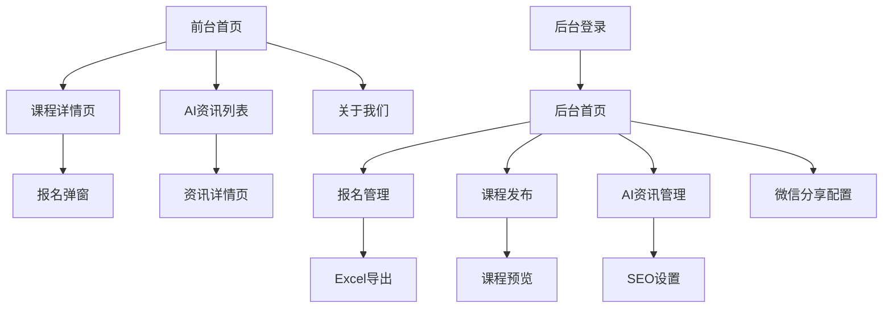

## 1. 产品概述（阶段2：运营提效）

第二阶段目标：在 MVP 的基础上引入后台管理与内容系统，让运营同学可以**不改代码**完成课程/资讯/分享配置与基础站点内容维护，同时提升 SEO 与社交传播效果。

- **目标用户**：在校大学生（前台）、运营/教务/销售（后台）。
- **核心价值**：
  - 运营提效：线索集中管理、导出给销售跟进。
  - 内容沉淀：课程与资讯可持续更新，带来搜索流量与复访。
  - 传播优化：微信分享卡片可配置，提升转发点击率。

## 2. 核心需求

### 2.1 角色与权限
| Role | Registration Method | Core Permissions |
|------|---------------------|------------------|
| 访客用户 | 无需注册 | 浏览课程信息、提交报名、分享内容 |
| 管理员 | 后台账号密码登录 | 管理报名信息、发布课程、编辑资讯、配置分享内容 |

### 2.2 功能模块（已实现）

#### 后台管理
1. **仪表盘**：关键数据概览（本周报名、已发布课程、资讯文章数）+ 最近报名动态。
2. **报名管理**：列表查看、搜索、导出 Excel。
3. **课程管理**：新增/编辑/发布/下架；封面本地上传。
4. **资讯管理**：新增/编辑/发布/草稿；封面本地上传；正文富文本编辑（类公众号后台体验）。
5. **分享配置**：按页面路径配置微信分享标题/描述/图片（图片支持本地上传），并在后台提供使用说明。
6. **师资管理**：讲师列表、增删改；头像上传与裁剪；首页师资自动读取。
7. **站点内容**：关于我们/会员权益动态配置（运营可随时修改）。

#### 前台展示
1. **首页动态公开课**：读取数据库中未来的已发布课程，自动展示“本周主推 + 近期预告”。
2. **AI 资讯**：`/news` 列表 + ` /news/:id` 详情（富文本渲染、阅读体验优化、上一篇/下一篇、侧栏推荐）。
3. **关于我们升级**：展示后台可配置内容 + 发展历程（时间轴组件）。

### 2.3 页面清单（与现状对齐）
| Page Name | Module Name | Feature description |
|-----------|-------------|---------------------|
| 后台首页 | 数据统计面板 | 显示本周新增报名、已发布课程数、资讯文章数；支持刷新。 |
| 后台首页 | 最近报名动态 | 展示最近 5 条线索，便于及时跟进。 |
| 报名管理 | 报名列表 | 展示所有报名信息：姓名、电话、微信、报名课程、提交时间 |
| 报名管理 | Excel导出 | 一键导出当前筛选结果到Excel文件，包含所有字段信息 |
| 课程管理 | 课程编辑器 | 富文本编辑课程内容；设置讲师、时间、地点与状态。 |
| 课程管理 | 封面上传 | 支持本地上传封面图并自动写入链接。 |
| AI资讯 | 文章列表 | 展示所有资讯文章：标题、分类、发布时间、阅读量、状态 |
| AI资讯 | 文章编辑器 | 富文本编辑（支持表格、图片、颜色、排版；支持从 Word/公众号复制粘贴文字结构）。 |
| AI资讯 | 封面上传 | 支持本地上传，或从正文图片中选择封面（并支持裁剪）。 |
| AI资讯 | SEO设置 | 为每篇文章设置独立的标题、关键词、描述，提升搜索排名 |
| 微信分享 | 分享配置 | 设置默认分享标题、描述、图标，支持不同页面独立配置 |
| 微信分享 | JS-SDK集成 | 对接微信JS-SDK，生成分享卡片，支持自定义分享内容 |
| 师资管理 | 讲师管理 | 讲师增删改、头像上传裁剪、首页展示顺序调整 |
| 站点内容 | 页面内容配置 | 关于我们文案、会员权益列表的动态维护 |

## 3. 核心流程

### 3.1 管理员操作流程
1. 管理员登录后台系统
2. 在仪表盘查看数据概览与最近线索
3. 进入报名管理模块，筛选和导出报名数据给销售团队
4. 使用课程发布功能，上传下周课程内容和图片
5. 发布AI资讯文章，设置SEO参数提升搜索曝光
6. 配置微信分享卡片，优化社交传播效果

### 3.2 访客用户流程（优化版）
1. 访客通过搜索引擎或分享链接进入网站
2. 浏览最新的AI资讯和本周公开课程
3. 查看详细的课程介绍和师资信息
4. 点击报名按钮，填写信息提交
5. 分享优质内容到微信，传播给更多同学

## 4. 体验与边界

### 4.1 UI 风格
- **主色调**：延续全站蓝色系，后台为浅色管理台风格（侧栏 + 内容区）。
- **按钮样式**：圆角设计，主要操作为实心按钮，次要操作为线框按钮
- **字体规范**：中文使用PingFang SC，英文使用Inter，正文字号14px，标题16-24px
- **布局风格**：后台采用侧边栏导航+主内容区的经典Admin布局
- **图标风格**：使用简洁的线性图标，保持视觉一致性

### 4.2 已知限制（当前实现）
- **微信分享本地不可测**：`localhost` 环境不执行签名请求；必须部署到正式域名并在公众号后台配置 JS 安全域名。
- **飞书复制图片受限**：飞书图片通常带鉴权/防盗链，直接复制整段图文可能无法显示；建议图片用“截图粘贴/本地上传”。
- **分享配置匹配规则**：目前按 `page_path` 完全匹配，不支持通配符（如 `/news/*`）。

### 4.3 Responsiveness
- 后台管理系统采用桌面端优先设计，最小支持1366px宽度
- 关键数据查看功能适配平板端（768px以上）
- 移动端主要通过前台展示，后台管理功能暂不支持手机端操作
