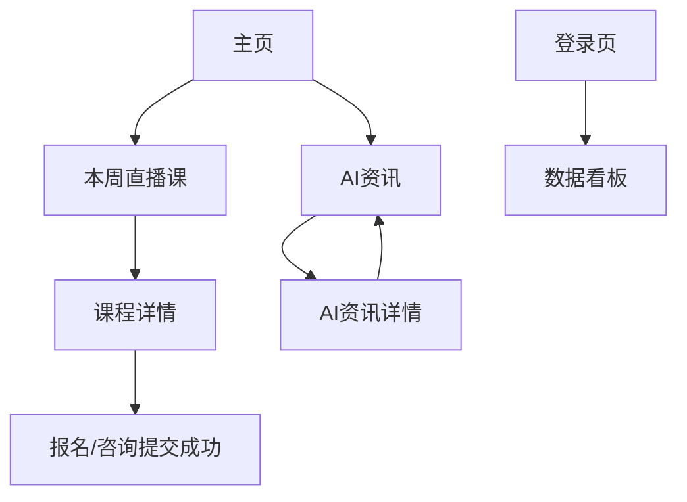

## 1. Product Overview
官网改版，围绕“本周直播课转化 + 课程承接 + AI资讯内容增长”重做信息架构与内容呈现，并用 GA4 漏斗与日常 5 报表形成运营闭环。
面向潜在学员/访客与运营团队，提升报名转化、内容触达与复盘效率。

## 2. Core Features

### 2.1 User Roles
| 角色 | 注册/进入方式 | 核心权限 |
|------|---------------|----------|
| 访客 | 无需注册 | 浏览首页/直播课/课程详情/AI资讯；提交直播课报名/咨询表单 |
| 运营人员 | 邮箱登录（管理员开通） | 访问数据看板；查看 GA4 漏斗与日常 5 报表；导出报表与填写当日结论 |

### 2.2 Feature Module
产品包含以下核心页面：
1. **主页**：品牌与核心卖点、快捷入口（本周直播课/AI资讯）、关键转化入口（报名/咨询）。
2. **本周直播课**：按周展示直播课列表与时间信息、单场进入课程详情、报名/预约。
3. **课程详情**：课程核心信息、适合人群、时间与讲师信息（如有）、主 CTA（报名/咨询）。
4. **AI资讯（原创+外链导读）**：资讯列表筛选与分组、详情页阅读（原创正文 / 外链导读+跳转）。
5. **数据看板（GA4 漏斗 + 日常 5 报表）**：漏斗与关键指标概览、每日 5 报表、结论与行动项记录。
6. **登录页**：运营人员登录与会话保持。

### 2.3 Page Details
| Page Name | Module Name | Feature description |
|-----------|-------------|---------------------|
| 主页 | 顶部导航与首屏 | 展示主导航（本周直播课/AI资讯）；突出核心卖点与主 CTA（报名/咨询）。 |
| 主页 | 核心入口区 | 提供“本周直播课”卡片入口与“AI资讯”入口；展示最新/置顶 1-3 条内容摘要。 |
| 主页 | 转化组件 | 提供报名/咨询表单入口（按钮或简表单）；提交后展示成功反馈与后续联系说明。 |
| 本周直播课 | 直播课列表（按周） | 展示本周直播课（时间、标题、状态：可报名/已结束）；支持进入课程详情。 |
| 本周直播课 | 报名/预约 | 在列表或详情入口触发报名；收集最小必要字段（姓名/手机号或微信/意向）。 |
| 课程详情 | 课程信息展示 | 展示课程亮点、适合人群、时间/地点或直播方式；提供返回“本周直播课”。 |
| 课程详情 | 主 CTA | 支持报名/咨询；对已结束课程展示“关注下期/加入交流群”引导（不新增功能前提下仅做文案引导）。 |
| AI资讯 | 列表与分组 | 区分“原创 / 外链导读”；展示标题、摘要、发布时间、标签；支持进入详情。 |
| AI资讯 | 资讯详情 | 原创：渲染正文；外链：展示导读（要点/适合读者/阅读价值）并提供外链跳转。 |
| AI资讯 | 关联推荐 | 在详情页展示 3-5 条相关资讯（同标签或同类型）。 |
| 数据看板 | GA4 漏斗 | 展示可配置漏斗（默认：主页→本周直播课→课程详情→点击报名→提交报名）；支持按日期范围与渠道查看。 |
| 数据看板 | 日常 5 报表 | 展示每日 5 份固定报表（见“核心过程”）；支持导出 CSV/复制摘要。 |
| 数据看板 | 闭环记录 | 记录当日结论（问题/机会）与行动项（负责人/截止时间）；支持次日回看对比。 |
| 登录页 | 登录 | 支持邮箱+密码登录；登录后跳转数据看板；退出登录。 |

## 3. Core Process
### 访客主流程（转化）
1) 访客从外部渠道进入主页，理解价值主张并点击“本周直播课”。
2) 在本周直播课列表选择单场课程进入课程详情。
3) 在课程详情点击报名/咨询并提交表单；提交成功后结束流程。

### 内容消费流程（AI资讯增长）
1) 访客进入 AI资讯列表，选择“原创”或“外链导读”。
2) 阅读详情：原创直接阅读正文；外链导读阅读摘要后跳转外部链接。
3) 在详情页通过关联推荐继续阅读。

### 运营闭环流程（GA4 漏斗 + 日常 5 报表）
1) 运营人员登录数据看板。
2) 查看 GA4 漏斗（默认漏斗：主页→本周直播课→课程详情→点击报名→提交报名），定位掉点与渠道差异。
3) 查看并输出“日常 5 报表”：
- 报表1：流量概览（会话/用户/渠道/落地页 Top）
- 报表2：漏斗转化（各步转化率与掉点）
- 报表3：直播课表现（每场：PV、详情进入率、报名数、报名率）
- 报表4：AI资讯表现（原创 vs 外链：PV、外链点击率、平均参与时间）
- 报表5：线索结果（表单提交数、去重后线索数、字段完整度）
4) 在“闭环记录”写下当日结论与行动项；次日回看并对比指标变化。

## 分阶段交付计划（建议）
- 阶段0（对齐与方案）：信息架构与关键文案；GA4 事件/漏斗口径；日常 5 报表定义与字段。
- 阶段1（官网改版 MVP）：主页/本周直播课/课程详情/AI资讯（含外链导读）；基础表单；基础埋点上线。
- 阶段2（数据闭环）：数据看板、漏斗可视化、日常 5 报表自动出数与导出；闭环记录（结论/行动项）。
- 阶段3（优化迭代）：基于漏斗与报表的页面与内容优化（文案、布局、入口权重），持续复盘迭代。
