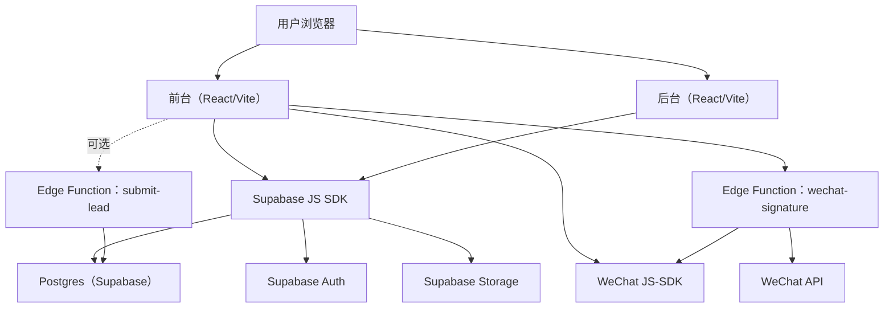

# 技术架构｜培训机构官网（整体：阶段1 + 阶段2）

## 1. 总览

本项目采用 **React + Supabase** 的轻量全栈方案：前台与后台同一套前端工程，使用 Supabase 作为后端服务（数据库、认证、存储、Edge Functions）。

## 2. 技术栈

- **前端**：React 18、Vite、TypeScript、TailwindCSS
- **路由**：react-router-dom
- **状态管理**：zustand（登录态）
- **富文本编辑**：TinyMCE（`@tinymce/tinymce-react`，CDN 脚本）
- **富文本安全渲染**：DOMPurify
- **图片裁剪**：react-easy-crop
- **导出 Excel**：xlsx
- **动效**：framer-motion
- **后端**：Supabase（Postgres、Auth、Storage、Edge Functions）

## 3. 关键模块与数据流

### 3.1 留资报名（Leads）
- 前台弹窗表单提交后写入 `public.leads`
- 当前实现为前端直连写入（依赖 RLS 允许匿名插入）
- 推荐上线前切换到 `submit-lead` Edge Function：实现限流、审计、通知、避免暴露表结构

### 3.2 内容管理（Courses / Articles / Teachers / Site Content）
- 后台通过 Supabase JS SDK 对表进行 CRUD
- 前台读取：
  - 首页读取 `courses`（已发布 + 未来时间）
  - 资讯读取 `articles`（已发布），详情页增加 `views`
  - 师资读取 `teachers`（按 display_order 排序）
  - 关于我们读取 `page_fragments`（about_us、member_benefits）

### 3.3 图片与资源（Storage）
- `course-covers`：课程封面、编辑器插图等
- `share-images`：微信分享图、讲师头像等（当前复用）
- `wechat-groups`：微信群二维码图片

### 3.4 微信分享
- 前端 hook 获取当前页面路径 → 查询 `share_configs`（静态页）或使用文章详情的标题/封面（动态页）
- 对接微信 JS-SDK 前需调用 `wechat-signature` 获取签名

### 3.5 会员与社群管理
- **付费会员**：后台支持 Excel 导入（xlsx 解析），写入 `paid_members`；
- **群二维码**：后台上传图片至 `wechat-groups` 桶，记录元数据至 `wechat_group_qr`；前台按需展示（当前逻辑未完全固化，预留接口）

## 4. 数据模型（核心表）

- `leads`：线索（报名信息）
- `courses`：课程（标题、封面、讲师、时间、地点、内容、状态）
- `articles`：资讯（标题、摘要、正文 HTML、SEO 字段、阅读量、状态）
- `share_configs`：微信分享配置（按页面路径）
- `teachers`：讲师
- `page_fragments`：站点内容片段（关于我们/会员权益等）
- `paid_members`：付费会员名单（手机号、姓名、批次）
- `wechat_group_qr`：微信群二维码（图片URL、状态）

## 5. 权限与安全（上线建议）

### 5.1 RLS 建议
- `leads`：匿名仅允许 INSERT，禁止匿名 SELECT；后台登录用户可 SELECT
- `courses/articles/teachers/page_fragments/share_configs`：匿名只能读 `published` 或 `active`；后台登录用户可全量管理
- `paid_members`：仅后台登录用户可全量管理（匿名不可读写）
- `wechat_group_qr`：后台管理，前台可能需要根据逻辑（如会员校验后）读取 active 状态的二维码

### 5.2 机密信息
- 前端仅使用 `VITE_SUPABASE_URL` 与 `VITE_SUPABASE_ANON_KEY`
- `WECHAT_APP_ID` / `WECHAT_APP_SECRET`、`SUPABASE_SERVICE_ROLE_KEY` 等仅配置在 Supabase Edge Functions 环境变量

## 6. 部署与环境

- 前端部署推荐：Vercel
- Supabase：使用 migrations 管理数据库结构
- 微信分享：部署到正式域名后，在公众号后台配置“JS接口安全域名”

