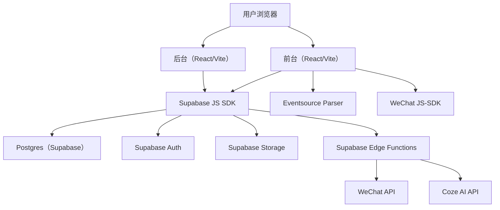

# 技术架构｜培训机构官网（整体：阶段1 + 阶段2 + AI工具）

## 1. 总览

本项目采用 **React + Supabase + Coze** 的现代全栈方案：前台与后台同一套前端工程，后端依托 Supabase 提供的 BaaS 能力，AI 能力通过 Supabase Edge Functions 代理转发至 Coze API。



## 2. 技术栈

- **前端核心**：React 18、Vite、TypeScript、TailwindCSS
- **路由**：react-router-dom (v6)
- **状态管理**：zustand（轻量级状态库，用于 Auth 和全局配置）
- **AI 流式解析**：`eventsource-parser`（标准 SSE 解析，处理粘包/分包）
- **富文本**：TinyMCE（CDN 引入，稳定可靠）
- **后端服务**：Supabase (BaaS)
  - Database: Postgres (RLS 权限控制)
  - Auth: Email/Password
  - Storage: 图片存储
  - Edge Functions: Deno (TypeScript)

## 3. 关键模块与数据流

### 3.1 留资报名（Leads）
- 前台弹窗表单提交后写入 `public.leads` 表。
- **安全策略**：启用 RLS，允许匿名 INSERT，但禁止匿名 SELECT。仅后台登录用户可查看。

### 3.2 内容管理（CMS）
- 涵盖课程、资讯、师资、站点配置。
- **图片处理**：前端集成 `react-easy-crop` 实现头像裁剪，上传至 Supabase Storage。
- **富文本**：集成 TinyMCE，支持图片上传（自动转存 Storage）和一键排版。

### 3.3 AI 智能体集成（Streaming Architecture）
为确保 AI 响应速度和数据安全，采用 **Proxy Stream** 架构：

1.  **前端请求**：用户输入 -> React 组件 -> 调用 Edge Function (`fortune-teller`)。
2.  **后端代理**：Edge Function 接收请求 -> 注入 API Key -> 转发给 Coze API (开启 `stream: true`) -> **透传 Response Body**（不做解析，直接 Pipe）。
3.  **前端解析**：React 组件收到 SSE 流 -> `eventsource-parser` 解析 Event -> 过滤系统消息 -> 实时更新 UI（打字机效果）。

### 3.4 微信生态
- **JS-SDK 签名**：前端调用 `wechat-signature` Edge Function 获取签名。
- **动态分享**：根据当前路由匹配 `share_configs` 表配置，动态设置分享卡片（标题/图/文）。

## 4. 目录结构规范

```bash
src/
├── features/           # 业务功能模块
│   └── ai-tools/       # AI 工具箱
│       ├── components/ # AI 专用组件 (FortuneTeller, XiaohongshuGenerator)
│       └── pages/      # AI 页面
├── components/         # 通用组件
│   ├── ui/             # 基础 UI 库 (Button, Card, Input...)
│   ├── layout/         # 布局组件 (Navbar, Footer...)
│   └── news/           # 新闻模块组件
├── lib/                # 工具库 (supabase client, utils)
├── pages/              # 页面路由
│   ├── admin/          # 后台页面
│   └── ...             # 前台页面
└── store/              # 全局状态 (useAuthStore)

supabase/
├── functions/          # Edge Functions (后端逻辑)
│   ├── chat-coze/      # (废弃) 旧版 AI 接口
│   ├── fortune-teller/ # 通用 AI 代理接口 (Stable)
│   └── ...
└── migrations/         # 数据库变更脚本
```

## 5. 部署方案

- **前端**：Vercel（自动化构建，Git Push 触发）
- **后端**：Supabase Cloud（全球边缘节点）
- **环境变量**：
  - `VITE_SUPABASE_URL`: 公开
  - `VITE_SUPABASE_ANON_KEY`: 公开
  - `COZE_API_KEY`: **仅后端可见** (Supabase Secrets)
  - `WECHAT_APP_ID`: **仅后端可见**

## 6. 安全设计

1.  **RLS (Row Level Security)**：数据库层级的权限控制，确保前台只能读已发布内容，后台才能读写全量数据。
2.  **API Key 隐藏**：所有第三方 API Key（Coze, WeChat）均存储在后端，前端不可见。
3.  **内容过滤**：AI 输出端增加 JSON 格式校验，防止 Coze 系统日志泄露给最终用户。
