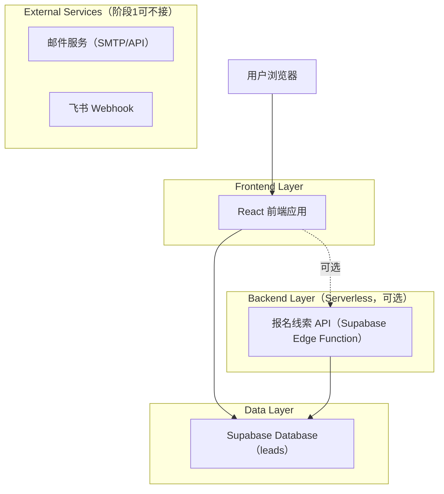
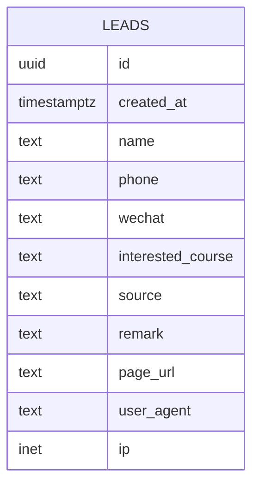

## 1. 架构设计（阶段1：MVP）


## 2. 技术栈
- 前端：React 18 + Vite + TailwindCSS
- 后端（BaaS）：Supabase（Postgres + Auth + Storage + Edge Functions）
- 路由：react-router-dom

## 3. 路由定义
| Route | Purpose |
|-------|---------|
| / | 首页：本周公开课、师资、立即报名弹窗、线索提交 | 
| /about | 关于我们：机构介绍与联系方式 |

## 4. 数据写入方式（当前实现与建议）

### 4.1 当前实现（前端直连写入）
- 前端通过 `@supabase/supabase-js` 直接 `insert` 到 `public.leads`
- 依赖 `leads` 表开启 RLS 并允许 `anon` 插入

优点：实现简单、开发速度快。

风险：线索表如果开放 `SELECT` 给 `anon` 会有隐私风险（当前数据库迁移中确实开放了 `SELECT`）。

### 4.2 推荐实现（Edge Function 写入）
```
POST /functions/v1/submit-lead
```

Edge Function 使用 `service_role_key` 写入数据库，并可在函数内实现：
- 限流/反滥用
- 通知（邮件/飞书）
- 字段清洗与审计

请求（建议 TypeScript 类型）
```ts
export type LeadSource = "home_open_class" | "home_teacher";

export type CreateLeadRequest = {
  name: string;
  phone: string;
  wechat?: string;
  interestedCourse?: string;
  source: LeadSource;
  remark?: string;
  page_url?: string;
  user_agent?: string;
};

export type CreateLeadResponse = {
  ok: boolean;
  leadId?: string;
  message?: string;
};
```

Response 示例
```json
{ "ok": true, "leadId": "c1b2..." }
```

安全与风控（建议）
- `service_role_key` 仅在 Edge Function 环境变量中保存，前端不可见。
- 基础反滥用：按 IP/UA 简单限流、honeypot。
- 线索隐私：禁止匿名 `SELECT`，仅后台登录态可读（建议）。

## 5. 数据模型

### 5.1 ER 图


### 5.2 DDL（简化）
Leads Table（`leads`）
```
-- create table
CREATE TABLE leads (
  id UUID PRIMARY KEY DEFAULT gen_random_uuid(),
  created_at TIMESTAMPTZ NOT NULL DEFAULT NOW(),
  name TEXT NOT NULL,
  phone TEXT NOT NULL,
  wechat TEXT,
  interested_course TEXT,
  source TEXT NOT NULL,
  remark TEXT,
  page_url TEXT,
  user_agent TEXT,
  ip INET
);

-- optional indexes
CREATE INDEX idx_leads_created_at ON leads(created_at DESC);
CREATE INDEX idx_leads_phone ON leads(phone);

-- RLS
ALTER TABLE leads ENABLE ROW LEVEL SECURITY;

-- 当前实现：允许匿名插入（以便前台直连提交）
-- 建议：不要允许匿名 SELECT
```
注：当前仓库迁移中存在对 `anon` 的 `SELECT` 授权（不建议）。上线前建议改为：仅 `authenticated` 可 SELECT，写入走 Edge Function。
