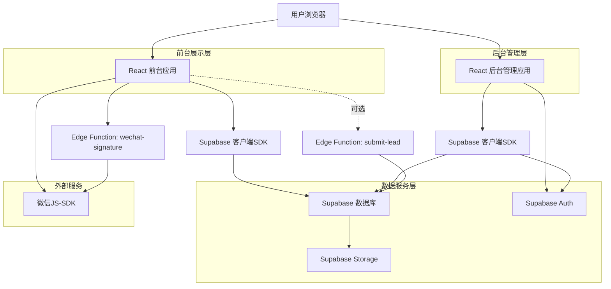
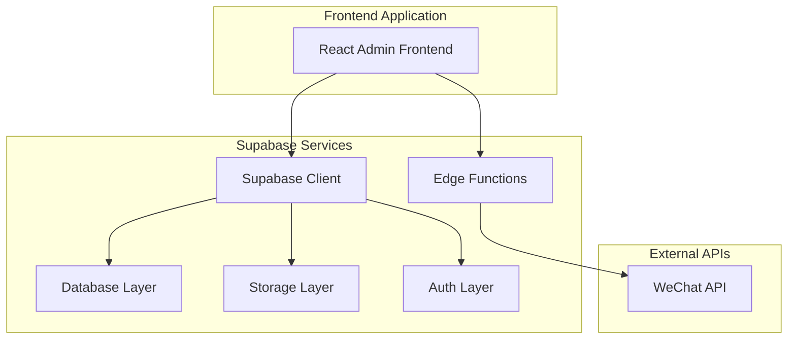
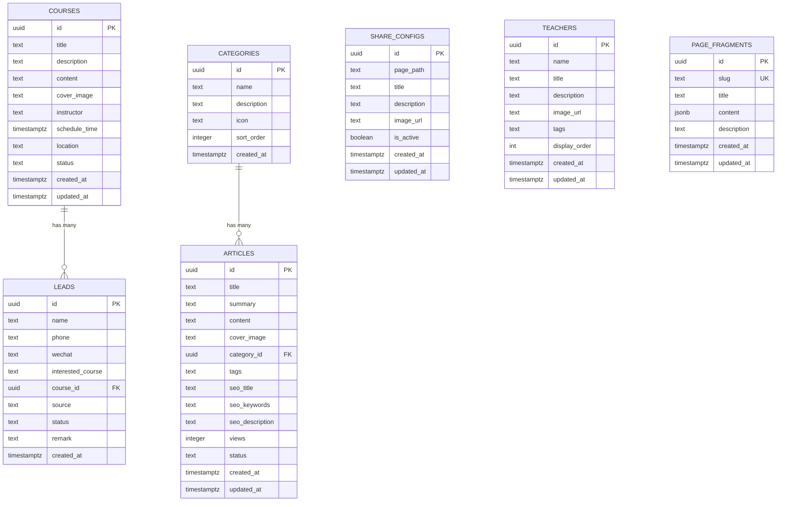

## 1. 架构设计（阶段2：运营提效）



## 2. 技术栈（与仓库依赖对齐）

- 前端：React 18 + Vite + TailwindCSS
- 路由：react-router-dom
- 状态：zustand（登录态/Session）
- 富文本：TinyMCE（`@tinymce/tinymce-react`，CDN 版脚本）
- 富文本安全渲染：DOMPurify
- 图片上传：Supabase Storage（`course-covers`、`share-images`）
- 图片裁剪：react-easy-crop
- 导出：xlsx
- 动效：framer-motion（用于关于我们发展历程时间轴）
- 后端（BaaS）：Supabase（Database + Auth + Storage + Edge Functions）

## 3. 路由定义

### 前台路由
| Route | Purpose |
|-------|---------|
| / | 首页：展示本周课程、师资介绍、报名入口 |
| /news | AI资讯列表页：展示所有资讯文章 |
| /news/:id | 资讯详情页：单篇文章的详细内容 |
| /about | 关于我们：机构介绍和联系方式 |

### 后台路由
| Route | Purpose |
|-------|---------|
| /admin/login | 管理员登录页 |
| /admin/dashboard | 后台首页：数据概览和快捷操作 |
| /admin/leads | 报名管理：查看和导出报名信息 |
| /admin/teachers | 师资管理：讲师列表 |
| /admin/teachers/new | 新建讲师 |
| /admin/teachers/edit/:id | 编辑讲师 |
| /admin/courses | 课程管理：发布和编辑课程 |
| /admin/courses/new | 新建课程：课程发布编辑器 |
| /admin/courses/edit/:id | 编辑课程：修改已有课程 |
| /admin/articles | 资讯管理：文章列表和管理 |
| /admin/articles/new | 新建文章：资讯发布编辑器 |
| /admin/articles/edit/:id | 编辑文章：修改已有文章 |
| /admin/share-config | 分享配置：微信分享卡片设置 |
| /admin/site-config | 站点内容：关于我们/会员权益配置 |

## 4. API / Edge Functions

### 4.1 认证（Supabase Auth）
```typescript
// 管理员登录
POST /auth/v1/token?grant_type=password
{
  email: string;
  password: string;
}
```

### 4.2 数据表操作（通过Supabase客户端）
```typescript
// 课程相关类型定义
interface Course {
  id: string;
  title: string;
  description: string;
  content: string;
  cover_image: string;
  instructor: string;
  schedule_time: string;
  location: string;
  status: 'draft' | 'published' | 'archived';
  created_at: string;
  updated_at: string;
}

// 资讯文章类型定义
interface Article {
  id: string;
  title: string;
  summary: string;
  content: string;
  cover_image: string;
  category_id: string;
  tags: string[];
  seo_title: string;
  seo_keywords: string;
  seo_description: string;
  views: number;
  status: 'draft' | 'published' | 'archived';
  created_at: string;
  updated_at: string;
}

// 报名信息扩展（在原有基础上）
interface Lead {
  id: string;
  name: string;
  phone: string;
  wechat?: string;
  interested_course?: string;
  course_id?: string; // 关联课程ID
  source: string;
  status: 'new' | 'contacted' | 'converted' | 'lost';
  remark?: string;
  created_at: string;
}
```

### 4.2 微信分享签名（Edge Function）
```typescript
POST /functions/v1/wechat-signature
{ url: string }

Response
{ appId: string; timestamp: number; nonceStr: string; signature: string }
```

### 4.3 报名提交（Edge Function，可选）
```typescript
POST /functions/v1/submit-lead
```

## 5. 服务端说明

由于采用 Supabase 托管服务，无需自建传统后端服务器。所有业务逻辑通过以下方式实现：

1. **数据库操作**：前台/后台通过 Supabase JS SDK 读写（受 RLS 约束）
2. **文件存储**：Supabase Storage（课程封面、分享图、讲师头像等）
3. **认证授权**：Supabase Auth（后台登录）
4. **微信分享**：前端集成微信 JS-SDK，Edge Function 生成签名



## 6. 数据模型（现状）

### 6.1 Data model definition


### 6.2 Data Definition Language

#### 课程表 (courses)
```sql
-- create table
CREATE TABLE courses (
  id UUID PRIMARY KEY DEFAULT gen_random_uuid(),
  title TEXT NOT NULL,
  description TEXT NOT NULL,
  content TEXT NOT NULL,
  cover_image TEXT,
  instructor TEXT NOT NULL,
  schedule_time TIMESTAMPTZ NOT NULL,
  location TEXT NOT NULL,
  status TEXT NOT NULL DEFAULT 'draft' CHECK (status IN ('draft', 'published', 'archived')),
  created_at TIMESTAMPTZ DEFAULT NOW(),
  updated_at TIMESTAMPTZ DEFAULT NOW()
);

-- create index
CREATE INDEX idx_courses_status ON courses(status);
CREATE INDEX idx_courses_schedule_time ON courses(schedule_time);
CREATE INDEX idx_courses_created_at ON courses(created_at DESC);

-- RLS policies
ALTER TABLE courses ENABLE ROW LEVEL SECURITY;

-- Allow anonymous users to read published courses
CREATE POLICY "Allow read published courses" ON courses
  FOR SELECT USING (status = 'published');

-- Allow authenticated users to manage all courses
CREATE POLICY "Allow full management for authenticated" ON courses
  FOR ALL USING (auth.role() = 'authenticated');

-- Grants
GRANT SELECT ON courses TO anon;
GRANT ALL ON courses TO authenticated;
```

#### 文章表 (articles)
```sql
-- create table
CREATE TABLE articles (
  id UUID PRIMARY KEY DEFAULT gen_random_uuid(),
  title TEXT NOT NULL,
  summary TEXT NOT NULL,
  content TEXT NOT NULL,
  cover_image TEXT,
  category_id UUID REFERENCES categories(id),
  tags TEXT[],
  seo_title TEXT,
  seo_keywords TEXT,
  seo_description TEXT,
  views INTEGER DEFAULT 0,
  status TEXT NOT NULL DEFAULT 'draft' CHECK (status IN ('draft', 'published', 'archived')),
  created_at TIMESTAMPTZ DEFAULT NOW(),
  updated_at TIMESTAMPTZ DEFAULT NOW()
);

-- create index
CREATE INDEX idx_articles_status ON articles(status);
CREATE INDEX idx_articles_category ON articles(category_id);
CREATE INDEX idx_articles_created_at ON articles(created_at DESC);
CREATE INDEX idx_articles_views ON articles(views DESC);

-- RLS policies
ALTER TABLE articles ENABLE ROW LEVEL SECURITY;

-- Allow anonymous users to read published articles
CREATE POLICY "Allow read published articles" ON articles
  FOR SELECT USING (status = 'published');

-- Allow authenticated users to manage all articles
CREATE POLICY "Allow full management for authenticated" ON articles
  FOR ALL USING (auth.role() = 'authenticated');

-- Grants
GRANT SELECT ON articles TO anon;
GRANT ALL ON articles TO authenticated;
```

#### 分类表 (categories)
```sql
-- create table
CREATE TABLE categories (
  id UUID PRIMARY KEY DEFAULT gen_random_uuid(),
  name TEXT NOT NULL UNIQUE,
  description TEXT,
  icon TEXT,
  sort_order INTEGER DEFAULT 0,
  created_at TIMESTAMPTZ DEFAULT NOW()
);

-- create index
CREATE INDEX idx_categories_sort_order ON categories(sort_order);

-- RLS policies
ALTER TABLE categories ENABLE ROW LEVEL SECURITY;

-- Allow anonymous users to read categories
CREATE POLICY "Allow read categories" ON categories
  FOR SELECT USING (true);

-- Allow authenticated users to manage categories
CREATE POLICY "Allow full management for authenticated" ON categories
  FOR ALL USING (auth.role() = 'authenticated');

-- Grants
GRANT SELECT ON categories TO anon;
GRANT ALL ON categories TO authenticated;
```

#### 分享配置表 (share_configs)
```sql
-- create table
CREATE TABLE share_configs (
  id UUID PRIMARY KEY DEFAULT gen_random_uuid(),
  page_path TEXT NOT NULL UNIQUE,
  title TEXT NOT NULL,
  description TEXT NOT NULL,
  image_url TEXT,
  is_active BOOLEAN DEFAULT true,
  created_at TIMESTAMPTZ DEFAULT NOW(),
  updated_at TIMESTAMPTZ DEFAULT NOW()
);

-- create index
CREATE INDEX idx_share_configs_path ON share_configs(page_path);
CREATE INDEX idx_share_configs_active ON share_configs(is_active);

-- RLS policies
ALTER TABLE share_configs ENABLE ROW LEVEL SECURITY;

-- Allow anonymous users to read active configs
CREATE POLICY "Allow read active configs" ON share_configs
  FOR SELECT USING (is_active = true);

-- Allow authenticated users to manage all configs
CREATE POLICY "Allow full management for authenticated" ON share_configs
  FOR ALL USING (auth.role() = 'authenticated');

-- Grants
GRANT SELECT ON share_configs TO anon;
GRANT ALL ON share_configs TO authenticated;
```

#### 更新线索表（添加新字段）
```sql
-- 为leads表添加新字段
ALTER TABLE leads 
ADD COLUMN IF NOT EXISTS course_id UUID REFERENCES courses(id),
ADD COLUMN IF NOT EXISTS status TEXT DEFAULT 'new' CHECK (status IN ('new', 'contacted', 'converted', 'lost'));

-- 创建相应索引
CREATE INDEX IF NOT EXISTS idx_leads_course_id ON leads(course_id);
CREATE INDEX IF NOT EXISTS idx_leads_status ON leads(status);

-- 更新RLS策略（保持原有策略不变）
```
