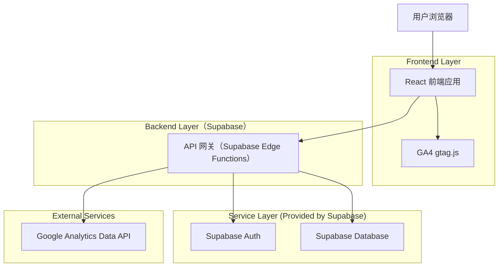
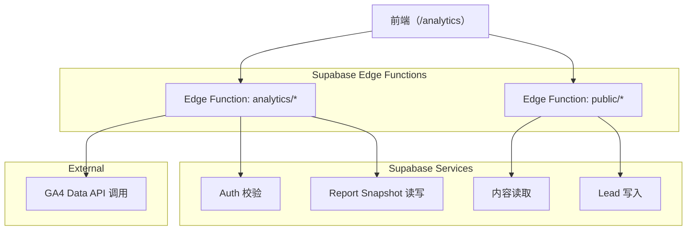
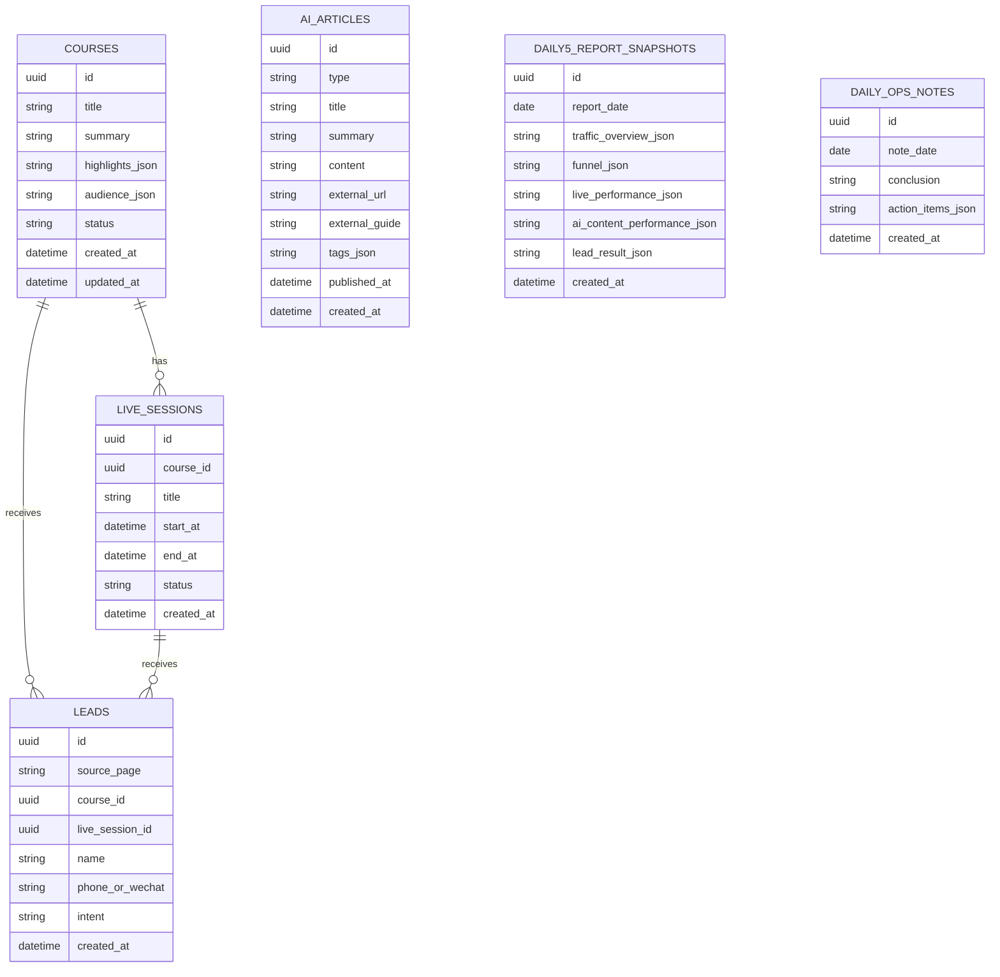

## 1.Architecture design


## 2.Technology Description
- Frontend: React@18 + react-router + tailwindcss@3 + vite + GA4 gtag.js
- Backend: Supabase（Auth + Database + Edge Functions + Scheduled Functions）

## 3.Route definitions
| Route | Purpose |
|-------|---------|
| / | 主页：核心卖点、入口与转化 CTA |
| /live | 本周直播课列表：按周展示与报名入口 |
| /course/:id | 课程详情：承接转化与报名 |
| /ai | AI资讯列表：原创/外链导读 |
| /ai/:id | AI资讯详情：原创正文或外链导读+跳转 |
| /login | 运营登录：进入数据看板 |
| /analytics | 数据看板：GA4 漏斗与日常 5 报表（需登录） |

## 4.API definitions
### 4.1 类型定义（前后端通用，TypeScript）
```ts
export type LiveSession = {
  id: string
  title: string
  startAt: string // ISO
  endAt?: string
  status: 'open' | 'ended'
  courseId: string
}

export type Course = {
  id: string
  title: string
  summary: string
  highlights: string[]
  audience: string[]
}

export type AiArticle = {
  id: string
  type: 'original' | 'external'
  title: string
  summary: string
  content?: string // original only
  externalUrl?: string // external only
  externalGuide?: string // external only
  tags: string[]
  publishedAt: string // ISO
}

export type Lead = {
  id: string
  sourcePage: 'home' | 'live' | 'course'
  courseId?: string
  liveSessionId?: string
  name?: string
  phoneOrWechat: string
  intent?: string
  createdAt: string
}

export type FunnelReport = {
  dateRange: { from: string; to: string }
  steps: Array<{ name: string; users: number; rateToNext?: number }>
  breakdown?: { channel: string; steps: Array<{ name: string; users: number }> }[]
}

export type Daily5ReportSnapshot = {
  id: string
  reportDate: string // yyyy-mm-dd
  trafficOverview: unknown
  funnel: unknown
  livePerformance: unknown
  aiContentPerformance: unknown
  leadResult: unknown
  createdAt: string
}

export type DailyOpsNote = {
  id: string
  noteDate: string // yyyy-mm-dd
  conclusion: string
  actionItems: Array<{ owner: string; dueDate: string; item: string }>
  createdAt: string
}
```

### 4.2 Edge Function API（示例）
- 内容
  - `GET /api/public/live-sessions?week=YYYY-WW`
  - `GET /api/public/course/:id`
  - `GET /api/public/ai?type=original|external&tag=`
  - `GET /api/public/ai/:id`
- 线索
  - `POST /api/public/leads`（提交报名/咨询表单）
- 数据看板（需登录）
  - `GET /api/analytics/funnel?from=YYYY-MM-DD&to=YYYY-MM-DD&channel=`
  - `GET /api/analytics/daily5?date=YYYY-MM-DD`
  - `POST /api/analytics/daily-note`（保存当日结论与行动项）

安全要点：GA4 Data API 的凭证（Service Account JSON / Token）仅保存在 Edge Function 环境变量中，前端不可见。

## 5.Server architecture diagram


## 6.Data model
### 6.1 Data model definition


### 6.2 Data Definition Language
```sql
-- courses
CREATE TABLE courses (
  id UUID PRIMARY KEY DEFAULT gen_random_uuid(),
  title TEXT NOT NULL,
  summary TEXT NOT NULL,
  highlights_json JSONB NOT NULL DEFAULT '[]',
  audience_json JSONB NOT NULL DEFAULT '[]',
  status TEXT NOT NULL DEFAULT 'active',
  created_at TIMESTAMPTZ NOT NULL DEFAULT NOW(),
  updated_at TIMESTAMPTZ NOT NULL DEFAULT NOW()
);

-- live_sessions
CREATE TABLE live_sessions (
  id UUID PRIMARY KEY DEFAULT gen_random_uuid(),
  course_id UUID NOT NULL,
  title TEXT NOT NULL,
  start_at TIMESTAMPTZ NOT NULL,
  end_at TIMESTAMPTZ,
  status TEXT NOT NULL DEFAULT 'open',
  created_at TIMESTAMPTZ NOT NULL DEFAULT NOW()
);
CREATE INDEX idx_live_sessions_start_at ON live_sessions (start_at);

-- ai_articles
CREATE TABLE ai_articles (
  id UUID PRIMARY KEY DEFAULT gen_random_uuid(),
  type TEXT NOT NULL CHECK (type IN ('original','external')),
  title TEXT NOT NULL,
  summary TEXT NOT NULL,
  content TEXT,
  external_url TEXT,
  external_guide TEXT,
  tags_json JSONB NOT NULL DEFAULT '[]',
  published_at TIMESTAMPTZ NOT NULL DEFAULT NOW(),
  created_at TIMESTAMPTZ NOT NULL DEFAULT NOW()
);
CREATE INDEX idx_ai_articles_published_at ON ai_articles (published_at DESC);

-- leads
CREATE TABLE leads (
  id UUID PRIMARY KEY DEFAULT gen_random_uuid(),
  source_page TEXT NOT NULL CHECK (source_page IN ('home','live','course')),
  course_id UUID,
  live_session_id UUID,
  name TEXT,
  phone_or_wechat TEXT NOT NULL,
  intent TEXT,
  created_at TIMESTAMPTZ NOT NULL DEFAULT NOW()
);
CREATE INDEX idx_leads_created_at ON leads (created_at DESC);

-- daily 5 report snapshots
CREATE TABLE daily5_report_snapshots (
  id UUID PRIMARY KEY DEFAULT gen_random_uuid(),
  report_date DATE NOT NULL UNIQUE,
  traffic_overview_json JSONB NOT NULL DEFAULT '{}',
  funnel_json JSONB NOT NULL DEFAULT '{}',
  live_performance_json JSONB NOT NULL DEFAULT '{}',
  ai_content_performance_json JSONB NOT NULL DEFAULT '{}',
  lead_result_json JSONB NOT NULL DEFAULT '{}',
  created_at TIMESTAMPTZ NOT NULL DEFAULT NOW()
);

-- daily ops notes
CREATE TABLE daily_ops_notes (
  id UUID PRIMARY KEY DEFAULT gen_random_uuid(),
  note_date DATE NOT NULL UNIQUE,
  conclusion TEXT NOT NULL,
  action_items_json JSONB NOT NULL DEFAULT '[]',
  created_at TIMESTAMPTZ NOT NULL DEFAULT NOW()
);

-- 权限（按 Supabase 常见策略：匿名仅读公开内容，登录用户全量；RLS 细则可后续补充）
GRANT SELECT ON courses, live_sessions, ai_articles TO anon;
GRANT ALL PRIVILEGES ON courses, live_sessions, ai_articles, leads, daily5_report_snapshots, daily_ops_notes TO authenticated;
```

补充：日常 5 报表可由 Scheduled Edge Function 每日生成写入 `daily5_report_snapshots`，看板读取历史快照，避免每次实时拉取 GA4。
